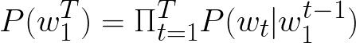
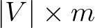
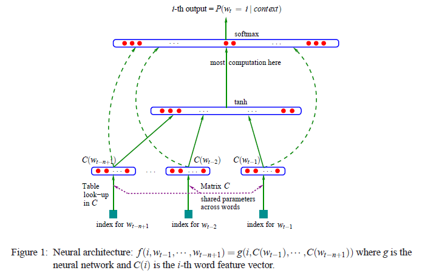

# Key Points from Abstract
- Goal of statistical language modelling: To learn the joint probabilistic function of sequences of words.
- Our approach learns:
  - A distributed word representation (i.e. a similarity between words)
  - The probability function for word sequences, expressed with these representations
- Generalization
# 1. Introduction (Key Points)
- Curse of Dimensionality
- A statistical model of language
- 
- 为了减少复杂度，提出n-gram模型，即下一个词的条件概率取决于最近的n-1个词：
- 
- 应用此模型时，如何泛化：遇到训练语料中未出现的sequence时，去看更短的上文sequence，__即long词序列的概率由short词序列（1、2、3个词）“gluing”得到__。
- 现有方法两个缺陷：
  - n-gram只考虑1、2、3个上文词汇，不包括更长的上文
  - 词之间的similarity没有考虑
## 1.1 用自身武器战胜维数灾难
本文提出的方法可简要概括为如下三点：
 1. 将此表V中的每一个词以distributed "feature vector"的方式联系起来，从而词之间有了相似性的概念；
 2. 用序列中词的特征向量来表示词序列的联合概率函数
 3. 同时学习词的特征向量表示与联合概率函数的参数
- __每一个词对应于向量空间中的一点，即一个向量表示了一个词的不同方面__。词的维度可以是30、60或100（远小于词表V的维度）。
- 概率函数依然是乘积形式，参数以迭代形式微调，来最大化损失函数。__词向量也同时被学习__。

 Generalization
- Word similarity: 词相似（semantically and syntactically）->特征向量相近
- Smooth function: 特征向量相近->概率相近
## 1.2 与之前工作的关系
之前工作
- 用神经网络对高维离散分布建模有意义（文献支撑）
- 对symbols用分布式表示的方式最早来自于联结主义（文献支撑）
- 用神经网络对语言建模不是最新的（文献支撑）
- 与用神经网络做基于字符的文本压缩的研究有关（文献支撑）
- 学习词聚类也是发现词之间相似性的方式之一（文献支撑）
- 用向量空间表示词已经用于信息检索领域（文献支撑）
- Latent Semantic Indexing: 基于同一文本中共现的概率来学习词向量（文献支撑）

 本工作
- 用来对比，学习词序列分布的统计模型，而非学习句中每个词的角色
- 并非用离散变量刻画相似性，而是用连续实数向量（分布式特征向量）
- 一个区别：作者look for词表示，其能够简洁的表示自然语言文本中的词序列的概率分布的。
# 2. 提出的模型：两种架构
1. 映射C（从V中元素到实数向量_in_R^m.png)）表示为的矩阵
2. 概率函数
 (a) Direct架构
 
 (b) Cycling架构

 
